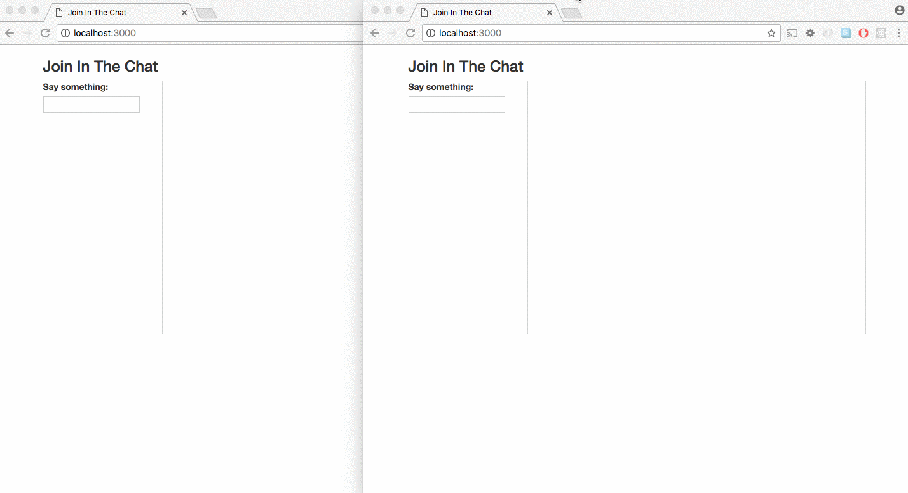

# Join in the Chat

Join in the Chat is a simple <a href="http://rubyonrails.org/">ruby on rails</a> application that utilizes <a href="https://github.com/rails/rails/tree/master/actioncable">action cables</a> to handle multiple connection instances. Messages are instantly rendered to the users asynchronously. Users can connect to the application from anywhere and engage in the conversation.



### Dependencies
* <a href="https://www.postgresql.org/">postgresql</a>
* <a href="https://www.ruby-lang.org/en/">ruby</a> 2.4.1 or greater
* <a href="http://rubyonrails.org/">rails</a> 5.1.2 or greater
* <a href="https://bundler.io/">bundler</a>


### Installation
````
$ postgres
$ git clone https://github.com/seanpierce/rails_chat_app
$ cd rails_chat_app
$ bundle
$ rails db:create
$ rails db:migrate
$ rails s
````
Visit <a href="http://localhost:3000/">localhost:3000</a>

### Author
Sean Pierce

### Contact
sumler.sean@gmail.com

### License
MIT, &copy; Sean Pierce 2017
